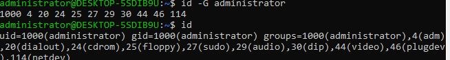
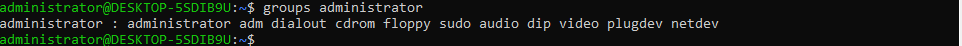
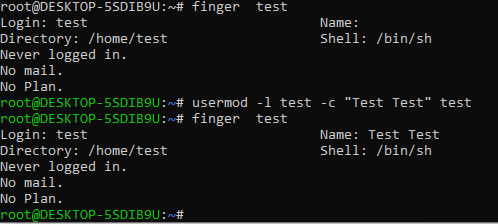
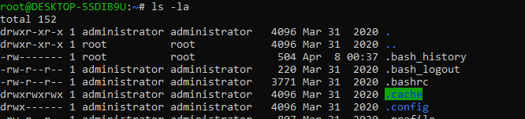
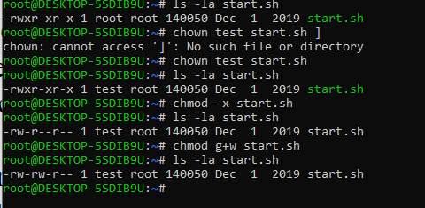
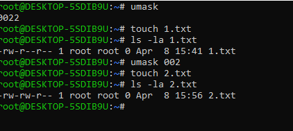
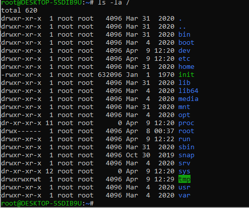

### Linux Essentials  Task2

1. /etc/passwd  - list of all registered users
   /etc/groups - list of all groups of users
Users existing in system: standart users and pseudo-users. 
Pseudo-users it's a system created users, for example:
 *syslog* for **rsyslog service**;
 *noboby* for different  purposes;
2. uid -  user identifier in linux system, decimal number fom 0 to 65535
   range 0-999 - system users, id 0 - reserved for root
   range 1000-65535 - regular uids

   comand to define uid:
   <pre>id  -u esername - uid</pre>
3. gid - user group identifier
   <pre>id  -G username - uid</pre>

  
4. 
5. Command to add user in Linux is **useradd** or **adduser** that is interactive alternative command with dialog for optional parameters. It has one required parameter - is username:
   <pre>useradd username</pre>
6. 
7. **skell_dir** - is a directory containing files that will be coppied when new user home dierctory. Default skeleton directory is /etc/skel, but can be overriden by **useradd -k skell_dir**. Usually this directory contains some set of default user config files such as *.bashrc*
8. **userdel -r username**  
9. **passwd -l username** - blocks specified account
   **passwd -u username** - ublocks specified account
10. **passwd -d username** - removes password from useraccount and allows to chage it by user
11. 

    **-rw-r--r-- 1 administrator administrator    220 Mar 31  2020 .bash_logout**

   *-rw-r--r--* - access wrights
   *1* - number of links
   *administrator administrator* - owner group
   *220* - size in bytes, can be converted in more readable format with -h key
   *Mar 31  2020* - date of last modification of item
   *.bash_logout* - name of item (file or subdirectory)

12. Linux access wrights has 3 roles in structure:
    + *owner* -  user that has access to file
    + *group* -  user is a member of a group that owns file
    + *other* -  other users that not owners and not in group
    Command **ls -l** shows 3 sets of "rwx"  symbols each for access wrights role
    *rwx* -  r - means read access, w - write access, x - use or execute.
    "-" instead of char means that this role has no such access for file.
    Example rw-r--r-- - owner can read and wright but cannot execute and other roles have readonly access.
13. Using commang **ls -l** or **ls -n** we can get named or numeric info of owner and group which owns file. 
    If uid field equal to user it means that user owns file.
    Using guid of file and **cat /etc/group | grep guid** we can realise membership user of that group.
    If no uid no giud equals, the user in outside (other) role.
      
14.  
15. File permissions can be specified in different ways and one of them is octal values fom 0 to 7.
*4* - read
*2* -  write
*1* - execute
So *rwx* = 4+2+1 = 7, ans allow all looks like *rwxrwxrwx*=*777*
 **umask** - specifices permission mask for newly created files and directories in wildcard notation, which shows what bit to remove. 

      

16.  Sticky bit is security mechanism tha helps protect important data from accidental removing. In permission attributes it is a last bit.
    <pre> -rw-r--r-t</pre> where **t** is a sticky bit.
 By default public dirs have sticky bits, as */tmp* for example.

17.  Command script should have read and execution attribute "r-x".

