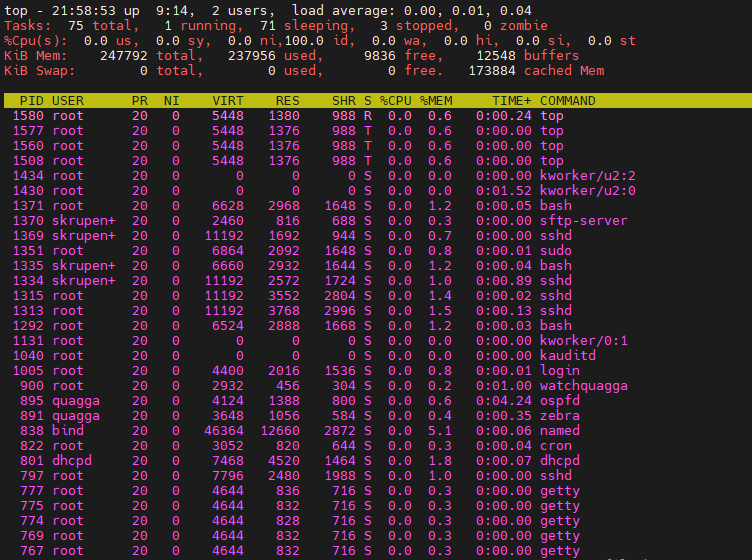

### Linux Essentials  Task3 Part1
1. It is 5 types of process state in linux:
    Running or Runnable (R)
    ninterruptible Sleep (D)
    Interruptable Sleep (S)
    Stopped (T)
    Zombie (Z)
2. 
    
3. Proc file system is virtual file system which contains information about currently runnig  processes. It is created at boot and destroyed when system shuts down.

  

4. 
   

5. 
    

6. Name of kernel processes is in square brackets. It is list of instructions  that can be managed by OS Kernel only.
  
    

    Other is a user space process.
7.  In ps utility it is *STAT* fiels which shown state of process, for example **S** - sleaping state and **R** - running ir runable, **Z** - will mean *zombie* process.

    

8.  Current user processes

   

9.  pgrep,pstree,top,proc.

10. Top command displays information of Linux process and system resources usage in realtime.

11. 

12. Top interactive command
    Shift + Z - select color to display
    Shift + P - sort by CPU usage
     

13. Screenshot displays chnaged color and sorted output by CPU time usage.

     
14. **Priority** - decimal value which is used by Linux kernel to schedule running process, higher value means that process have more priority in CPU queue. There is 2 columns in top utility **PR** - priority of process and **NI** - user-spave value (from -20 to 19) which help to control and modify process priority. 
   *nice -n nice_val [command]* - command to run process with some nice value;
   *renice -n nice_val -p [pid]* - command to modify nice value if running process.
15. By pressing *r* in top command we can change priority of process.
     

16. **kill -signal pid** - command which sends some stop signal to process. Typical signals: *SIGTERM* - sends terminate request to process, used by deafult in kill command
*SIGKILL* - terminates process and child processes immediately 
*SIGSTOP* - stops process execution untill SIGCONT will be sent.
17. **jobs** - shows list of running tasks
    **fg [task number]** - moves task from background to foreground
    **bg [task number]** -  moves task from foreground to background
    

    