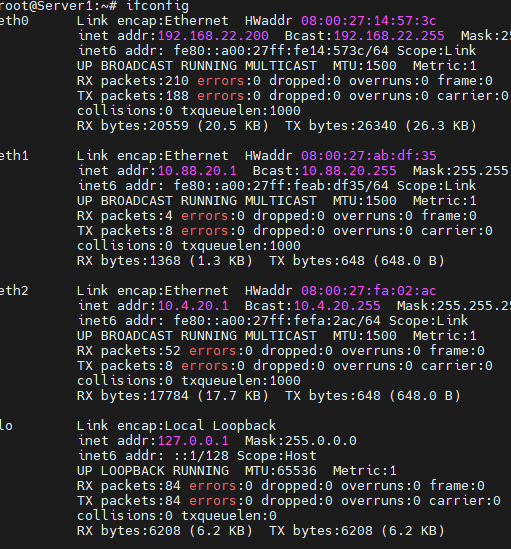
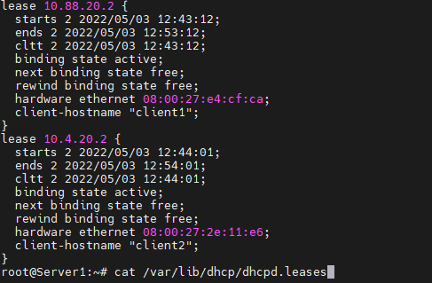
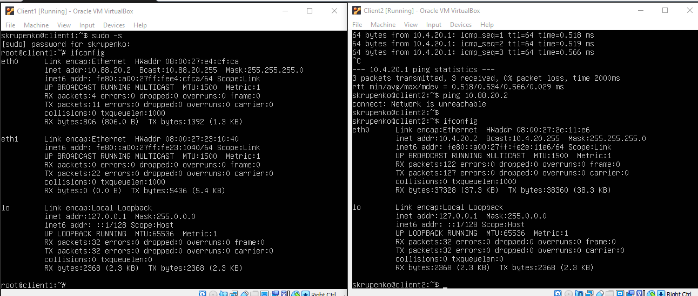
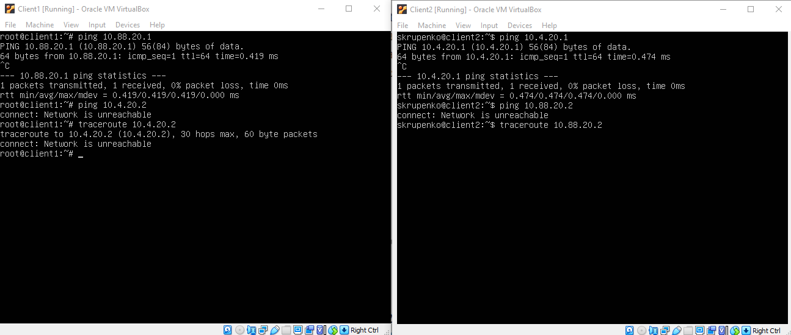
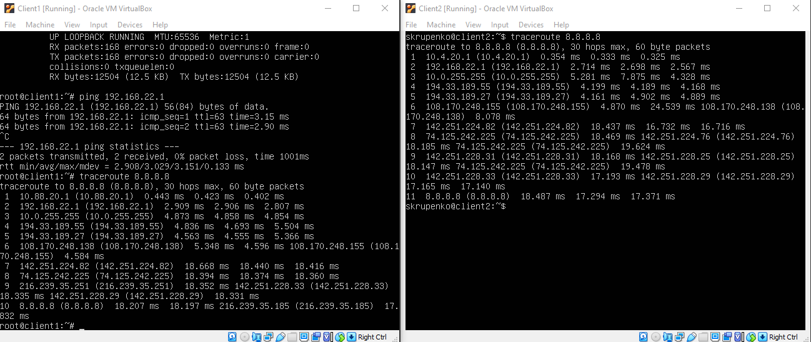
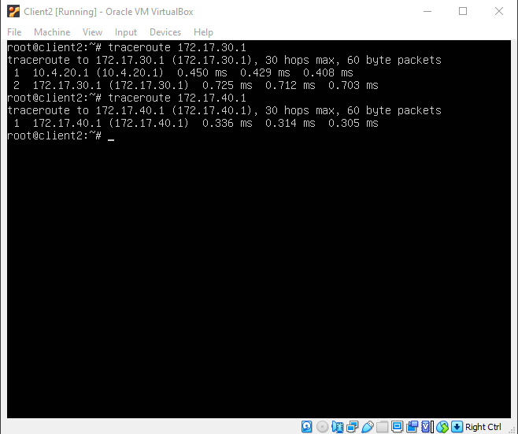

### Linux Networking  Task1 

| VM Name 	| Network        	|
|---------	|----------------	|
| Server1 	| 192.168.22.200 	|
| Net2    	| 10.88.20.0/24  	|
| Net3    	| 10.4.20.0/24   	|
| Net4    	| 172.16.20.0/24 	|

1. 

| Server1   Interface 	| Address        	|
|---------------------	|----------------	|
| Int1                	| 192.168.22.200 	|
| Int2                	| 10.88.20.1     	|
| Int3                	| 10.4.20.1      	|

  

| Client1   Interface 	| Address        	|
|---------------------	|----------------	|
| Int1                	| 10.88.20.2     	|
| Int2                	| 172.16.20.0/24 	|

| Client2   Interface 	| Address        	|
|---------------------	|----------------	|
| Int1                	| 10.4.20.2      	|
| Int2                	| 172.16.20.0/24 	|

2.  
    
    

3.   
 
    Client1 and Client2 are in different subnets and broadcast domains. But their is no routing and deafult gateway configured.
     
4. 
    